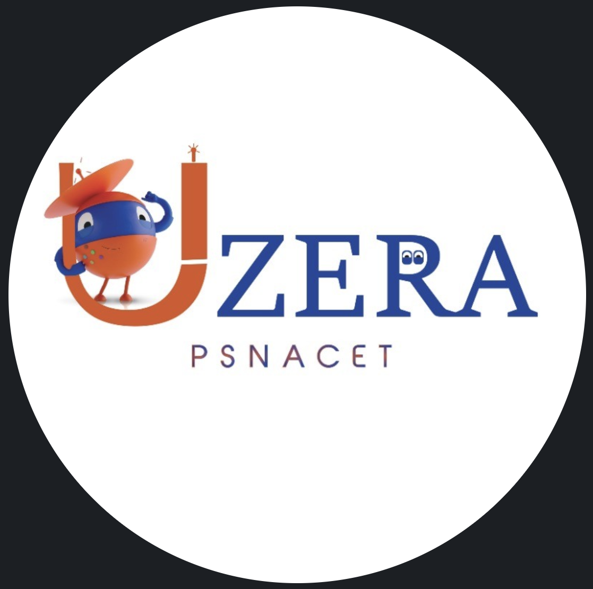
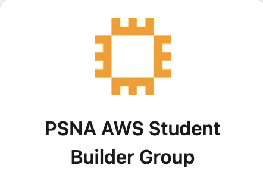

# Sakthi Pranaash V

### Software Engineer · AI/ML Enthusiast · Problem Solver

Software Engineer and Artificial Intelligence & Machine Learning enthusiast pursuing a B.Tech in Artificial Intelligence & Data Science. I have hands-on experience in Machine Learning, NLP, Generative AI, backend engineering, intelligent automation, and secure AI systems.

I enjoy solving complex problems, building practical systems, and continuously improving my engineering skills through real-world development and technical challenges.

---

## About Me

- Software Engineer working with **Java, Python, Machine Learning, NLP, Generative AI, and Backend Engineering**.
- Build NLP pipelines using **Sentence Transformers and Scikit-learn** for skill extraction, recommendation generation, prompt injection detection, and jailbreak detection.
- Developed an automated **job intelligence pipeline** aggregating opportunities from **10+ recruitment platforms**, reducing manual job discovery effort by approximately **70%**.
- Solved **400+ problems on LeetCode**, strengthening Data Structures and Algorithms fundamentals.
- Interested in the intersection of **AI and Software Engineering**, with a focus on building practical, scalable, and reliable solutions.
- Actively participate in **hackathons, technical communities, and collaborative engineering projects**.

---

## AI / ML Experience

### Appin Technologies

**AI / ML Engineering**

- Developed an automated **job intelligence pipeline** for collecting and processing job opportunities from multiple recruitment platforms.
- Built NLP pipelines using **Sentence Transformers** for technical skill extraction.
- Implemented personalized **learning and skill recommendations** based on semantic similarity.
- Automated job discovery workflows, significantly reducing manual effort.

### Gradtwin

**AI Security / NLP Engineering**

- Developed an NLP security pipeline for detecting **Prompt Injection and Jailbreak attempts**.
- Used **Sentence Transformers and Scikit-learn** for semantic analysis and classification.
- Built a **Flask inference API** with confidence scoring.
- Designed the inference pipeline to provide responses in **under 100 ms**.

### Areas of Interest

`Natural Language Processing` · `Generative AI` · `RAG` · `AI Agents` · `Semantic Similarity` · `Prompt Engineering` · `AI Security` · `Intelligent Automation`

---

## Technical Achievements

- **Smart India Hackathon 2024 — Finalist**
- **MEDHA National Hackathon 2026 — Top 5**
- **Techie of the Year — PSNACET 2024**
- **400+ LeetCode Problems Solved**
- **Silver Badge — Java | HackerRank**

---

## Technical Leadership

  <strong>✦ LEADERSHIP & COMMUNITY ✦</strong>

  
    Building • Leading • Mentoring • Innovating
  

 

&nbsp;&nbsp;&nbsp;&nbsp;&nbsp;&nbsp;&nbsp;&nbsp;&nbsp;&nbsp;&nbsp;&nbsp;&nbsp;&nbsp;&nbsp;&nbsp;

<strong>TECHNICAL LEAD</strong>
&nbsp;&nbsp;&nbsp;&nbsp;&nbsp;&nbsp;&nbsp;&nbsp;&nbsp;&nbsp;&nbsp;&nbsp;&nbsp;&nbsp;&nbsp;&nbsp;&nbsp;&nbsp;&nbsp;&nbsp;&nbsp;&nbsp;
<strong>CLOUD CHAMP</strong>

<b>UiPath Students Club</b>
&nbsp;&nbsp;&nbsp;&nbsp;&nbsp;&nbsp;&nbsp;&nbsp;&nbsp;&nbsp;&nbsp;&nbsp;&nbsp;&nbsp;&nbsp;&nbsp;
<b>PSNA AWS Student Builder Group</b>

  ─────────────────────────────────────────

<code>LEADERSHIP</code>
&nbsp;&nbsp;
<code>MENTORSHIP</code>
&nbsp;&nbsp;
<code>ENGINEERING</code>

&nbsp;&nbsp;&nbsp;&nbsp;&nbsp;&nbsp;&nbsp;&nbsp;

<code>AWS</code>
&nbsp;&nbsp;
<code>CLOUD</code>
&nbsp;&nbsp;
<code>COMMUNITY</code>

  <i>
    Empowering people • Exploring technology • Building impact
  </i>

---

## Tech Stack

I work with:

I also work with:

`Scikit-learn` · `NumPy` · `Pandas` · `Transformers` · `LangChain` · `RAG` · `Prompt Engineering` · `AI Agents` · `Power BI`

---

## Software I Use

---

## 📜 Certifications

<table>
<tr>

<td align="center" width="25%">

 

<strong>AWS Certified</strong> 
Data Engineer – Associate

</td>

<td align="center" width="25%">

 

<strong>AWS Certified</strong> 
Cloud Practitioner

</td>

<td align="center" width="25%">

 

<strong>Oracle Cloud</strong> 
OCI 2024 Generative AI Professional

</td>

<td align="center" width="25%">

 

<strong>Google</strong> 
Cybersecurity Certificate

</td>

</tr>
</table>

---

## Social Links

&nbsp;&nbsp;&nbsp;
&nbsp;&nbsp;&nbsp;
&nbsp;&nbsp;&nbsp;
&nbsp;&nbsp;&nbsp;
&nbsp;&nbsp;&nbsp;
&nbsp;&nbsp;&nbsp;
&nbsp;&nbsp;&nbsp;

---

## Currently

I'm continuously strengthening my software engineering fundamentals while exploring **AI/ML, Generative AI, backend systems, system design, and intelligent applications**.

I'm looking for opportunities where I can work on meaningful engineering problems, learn from strong teams, contribute technically, and grow into a **well-rounded Software Engineer**.

---

## Let's Connect

If you're working on an interesting engineering problem, building something ambitious, or looking for someone who enjoys learning by building, I'd be glad to connect.

---

  Built with curiosity, consistency, and a passion for engineering.

